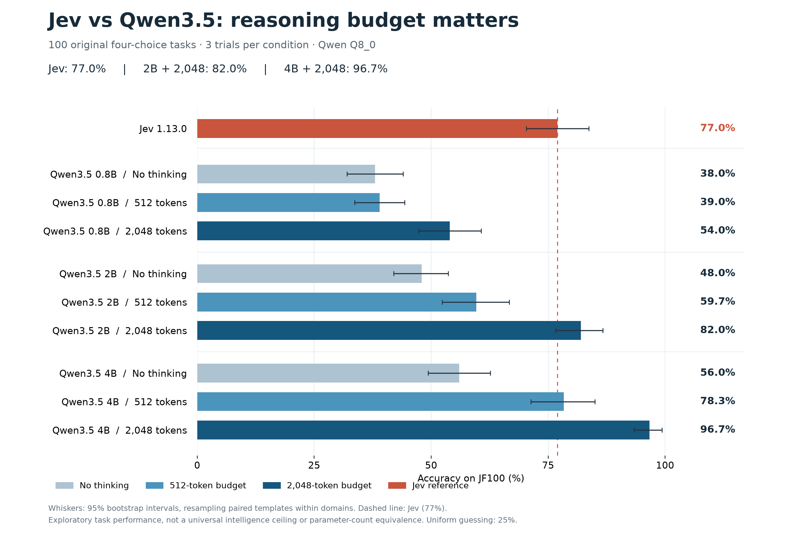
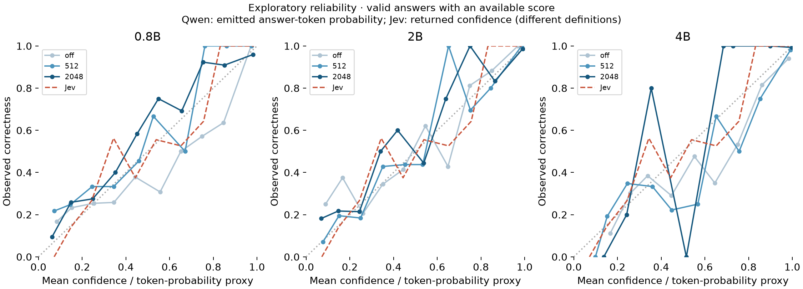

# Results: Jev and nine Qwen settings

All ten published conditions are complete: 3,000 records, 100% valid final answers. These are exploratory results from a selected release scope.

## Overall accuracy

| Condition | Correct / 300 | Accuracy | 95% paired-template interval | Mean generated tokens |
|---|---:|---:|---:|---:|
| jev | 231 | 77.0% | 70.3–83.7% | — |
| qwen3.5:0.8b / off | 114 | 38.0% | 32.0–44.0% | 10 |
| qwen3.5:0.8b / 512 | 117 | 39.0% | 33.7–44.3% | 527 |
| qwen3.5:0.8b / 2048 | 162 | 54.0% | 47.3–60.7% | 1955 |
| qwen3.5:2b-q8_0 / off | 144 | 48.0% | 42.0–53.7% | 11 |
| qwen3.5:2b-q8_0 / 512 | 179 | 59.7% | 52.3–66.7% | 515 |
| qwen3.5:2b-q8_0 / 2048 | 246 | 82.0% | 76.7–86.7% | 1636 |
| qwen3.5:4b-q8_0 / off | 168 | 56.0% | 49.3–62.7% | 11 |
| qwen3.5:4b-q8_0 / 512 | 235 | 78.3% | 71.3–85.0% | 511 |
| qwen3.5:4b-q8_0 / 2048 | 290 | 96.7% | 93.3–99.3% | 1154 |

## Domain profile

Each cell is correct answers out of 30 (10 items × 3 trials).

| Domain | jev | qwen3.5:0.8b / off | qwen3.5:0.8b / 512 | qwen3.5:0.8b / 2048 | qwen3.5:2b-q8_0 / off | qwen3.5:2b-q8_0 / 512 | qwen3.5:2b-q8_0 / 2048 | qwen3.5:4b-q8_0 / off | qwen3.5:4b-q8_0 / 512 | qwen3.5:4b-q8_0 / 2048 |
|---|---:|---:|---:|---:|---:|---:|---:|---:|---:|---:|
| algorithms | 15/30 | 5/30 | 7/30 | 16/30 | 5/30 | 13/30 | 27/30 | 10/30 | 19/30 | 30/30 |
| code_semantics | 30/30 | 5/30 | 9/30 | 15/30 | 12/30 | 21/30 | 21/30 | 17/30 | 25/30 | 30/30 |
| customer_service | 27/30 | 14/30 | 19/30 | 27/30 | 21/30 | 25/30 | 28/30 | 28/30 | 29/30 | 30/30 |
| discourse | 30/30 | 22/30 | 16/30 | 23/30 | 26/30 | 22/30 | 28/30 | 23/30 | 27/30 | 28/30 |
| evidence_integration | 21/30 | 16/30 | 9/30 | 11/30 | 15/30 | 12/30 | 12/30 | 16/30 | 20/30 | 25/30 |
| formal_logic | 30/30 | 7/30 | 8/30 | 8/30 | 17/30 | 14/30 | 21/30 | 14/30 | 23/30 | 30/30 |
| mathematics | 24/30 | 9/30 | 15/30 | 20/30 | 11/30 | 19/30 | 30/30 | 12/30 | 21/30 | 30/30 |
| policy_rules | 30/30 | 16/30 | 15/30 | 23/30 | 18/30 | 25/30 | 30/30 | 25/30 | 30/30 | 30/30 |
| relations | 10/30 | 12/30 | 9/30 | 13/30 | 9/30 | 17/30 | 29/30 | 12/30 | 23/30 | 30/30 |
| temporal | 14/30 | 8/30 | 10/30 | 6/30 | 10/30 | 11/30 | 20/30 | 11/30 | 18/30 | 27/30 |

## Paired comparisons

Differences are percentage points; intervals resample 50 paired templates within domains. They are exploratory, not multiplicity-adjusted population claims.

- qwen3.5:0.8b / off minus jev: -39.0 points [-47.7, -30.0].
- qwen3.5:0.8b / 512 minus jev: -38.0 points [-46.3, -30.0].
- qwen3.5:0.8b / 2048 minus jev: -23.0 points [-30.3, -15.3].
- qwen3.5:2b-q8_0 / off minus jev: -29.0 points [-37.0, -21.3].
- qwen3.5:2b-q8_0 / 512 minus jev: -17.3 points [-24.0, -10.7].
- qwen3.5:2b-q8_0 / 2048 minus jev: +5.0 points [-2.3, +12.3].
- qwen3.5:4b-q8_0 / off minus jev: -21.0 points [-28.3, -13.7].
- qwen3.5:4b-q8_0 / 512 minus jev: +1.3 points [-4.3, +7.0].
- qwen3.5:4b-q8_0 / 2048 minus jev: +19.7 points [+12.7, +26.7].
- qwen3.5:0.8b / 512 minus qwen3.5:0.8b / off: +1.0 points [-5.3, +7.3].
- qwen3.5:0.8b / 2048 minus qwen3.5:0.8b / off: +16.0 points [+7.7, +24.0].
- qwen3.5:2b-q8_0 / 512 minus qwen3.5:2b-q8_0 / off: +11.7 points [+5.0, +18.0].
- qwen3.5:2b-q8_0 / 2048 minus qwen3.5:2b-q8_0 / off: +34.0 points [+28.3, +39.7].
- qwen3.5:4b-q8_0 / 512 minus qwen3.5:4b-q8_0 / off: +22.3 points [+14.7, +30.3].
- qwen3.5:4b-q8_0 / 2048 minus qwen3.5:4b-q8_0 / off: +40.7 points [+34.0, +47.3].

## Confidence diagnostics

Qwen uses an unnormalized answer-token probability; Jev uses returned confidence. The Brier score treats each as a proxy probability of correctness, conditional on valid answers with an available score. Different definitions and missing coverage limit direct comparisons.

| Condition | Available / 300 | Brier proxy (lower is better) |
|---|---:|---:|
| jev | 300 | 0.0838 |
| qwen3.5:0.8b / off | 300 | 0.2046 |
| qwen3.5:0.8b / 512 | 295 | 0.1822 |
| qwen3.5:0.8b / 2048 | 297 | 0.1381 |
| qwen3.5:2b-q8_0 / off | 300 | 0.2016 |
| qwen3.5:2b-q8_0 / 512 | 300 | 0.1232 |
| qwen3.5:2b-q8_0 / 2048 | 300 | 0.0622 |
| qwen3.5:4b-q8_0 / off | 300 | 0.1799 |
| qwen3.5:4b-q8_0 / 512 | 300 | 0.0784 |
| qwen3.5:4b-q8_0 / 2048 | 300 | 0.0164 |

The dataset is AI-assisted and lacks independent human expert review. Questions, responses and all trials in retained conditions are unchanged. Latency is not a controlled hardware-normalized speed comparison.
